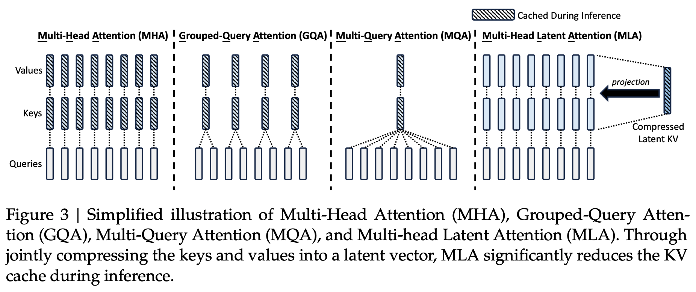
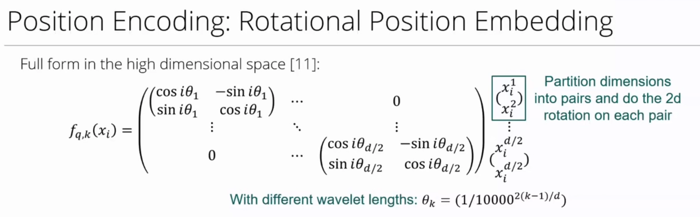

# Week2: Training Objectives and Transformers Advancements

## Learning

1. Learning Objectives

    - Pre-Training: Next-token Prediction (Full Language Modeling for Decoder-Only Model)
        - Learn the structure of natural language
        - Learn humans' understanding of the world
    - Post-Training: Supervised Fine-Tuning / Reinforcement with Human Feedback
        - Post-training often involves smaller, higher-quality datasets and specialized training methods
        - The focus is on refining the model to ensure it is safe, aligned, and helpful

2. Transformer Advancements

    - Activation functions and bilinear layers

        SiLU function $silu(x) = x \cdot sigmoid(x)$

        ```python
        def forward(self, x):
            return self.w2(F.silu(self.w1(x)) * self.w3(x))
        ```

    - Efficient Attention mechanisms

        Group Query Attention (GQA) -> Multi-head Latent Attention (MLA)

        

    - LayerNorm

        $$LN(x) = \frac{x - \mu}{\sqrt{\sigma^2(x) + \epsilon}} \times \gamma + \beta$$

        $\gamma$ and $\beta$ are learnable parameters.

        

    - RMSNorm (Only rescaling, no recentering)

        $$RMS(x_i) = \frac{x_i}{\sqrt{\frac{1}{d} \sum_i{x_i^2} + \epsilon}} \times \gamma$$

        Better convergence rate on large scale models.

    - Rotational Positional Embedding (RoPE)

        RoPE helps keep relative positional embedding by rotation matrices.

        

        More to read at [Complete Summary of Absolute, Relative and Rotary Position Embeddings!](https://azizbelaweid.substack.com/p/complete-summary-of-absolute-relative)

## Interesting Notes from Piazza

- Packing and Padding in LLM training and inference

    Here we would like to discuss three terms `batch_size`, `sequence_length` and `grad_accumulation_steps`.

    In the original “Attention is All You Need” paper, they used this definition of batch size. As a concrete example, if your Transformer is implemented with a sequence length of 512 and your batch size is 4, at train-time you would take 4 sequences, pad or truncate each of them to be 512 tokens, and this [4 x 512] matrix would be the input to your model.

    On small GPUs, the batch size that fits into memory tends to be very small; it could only be 1 or 2 examples. However, research has shown that neural networks train better with larger batch sizes, so this is where grad_accumulation_steps comes into play. Rather than computing the gradients after every step, the losses from several batches are accumulated together before the gradient is computed. This allow people with small GPUs to pretend (as far as the optimization is concerned) they are using a bigger GPU capable of larger batch sizes.

    More recently, researchers developed the idea of packing, which changed how we think about batches. Rather than having the two terms, batch_size and sequence_length, the idea is to just have sequence_length: the maximum number of tokens the Transformer can input.

    The main idea behind packing is that the training data is concatenated together until the total number of tokens adds up to the max sequence length. This HuggingFace post gives more details on how this is actually implemented: [Efficient LLM Pretraining: Packed Sequences and Masked Attention](https://huggingface.co/blog/sirluk/llm-sequence-packing). It is very standard now for pre-trained to be on packed batches. This method is more efficient because it does not waste any token positions on useless “pad” tokens. When using packing, “batch size” now refers to the same thing as sequence length.

    For finetuning and inference, it is still pretty common to do padding rather than packing. Padding is simpler to implement than packing since you don’t need to do as complicated things with the attention mask. It is also more useful for generation, since at every step of generation, you’re basically replacing one of the pad tokens with the token you’ve selected to generate.

- [Transformer Math 101](https://blog.eleuther.ai/transformer-math/)

- Training Deep Learning Models Recipe

  - [Google Tuning Playbook](https://github.com/google-research/tuning_playbook)
  - [Andrej Karpathy Training NN Recipe](https://karpathy.github.io/2019/04/25/recipe/)

- Understand [nanoGPT](https://bbycroft.net/llm)
