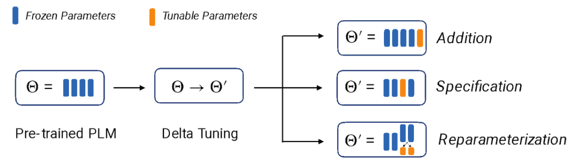
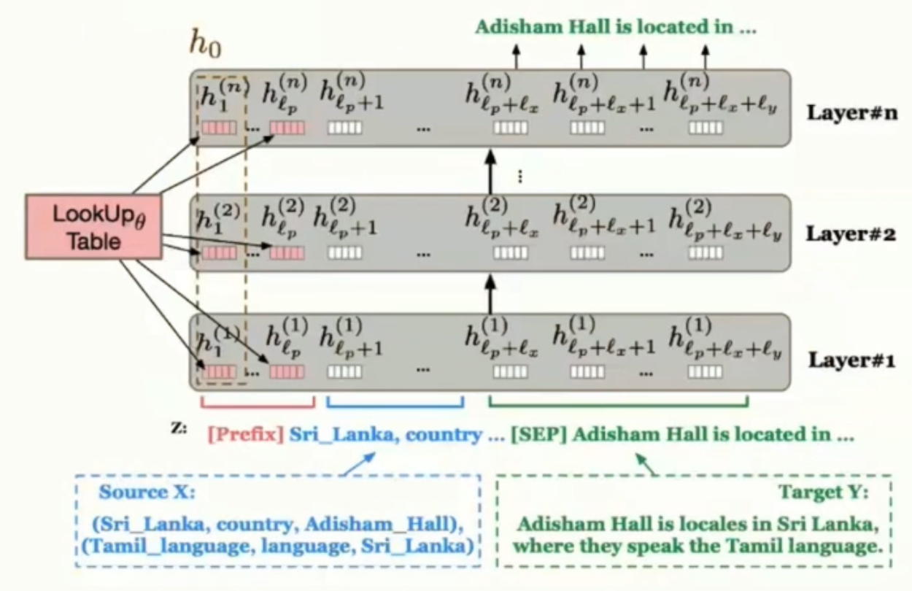
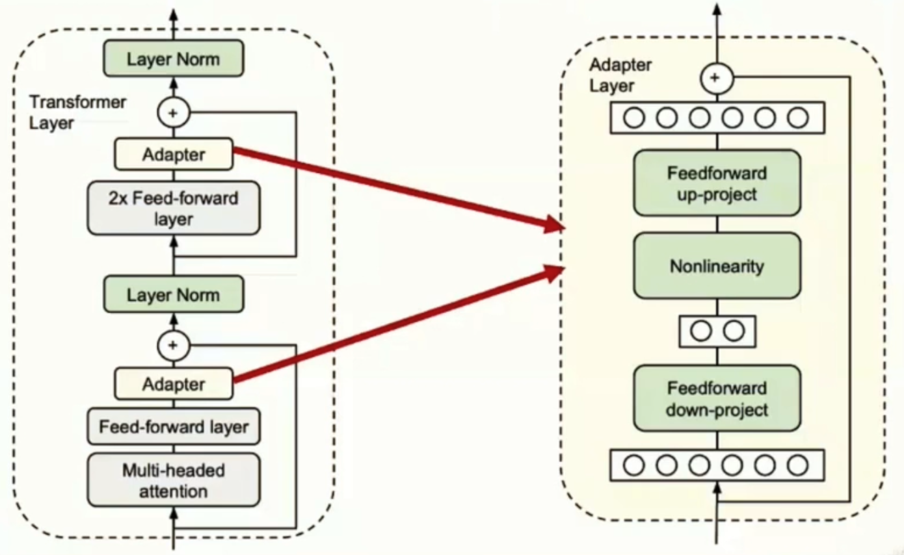

# Week5: Task Adaptation of Pretrained Language Models

## Learning

1. Multi-task Finetuning

    In the [T5 paper](https://arxiv.org/pdf/1910.10683), the authors compared a pre-trained model that was finetuned for individual tasks with a model that was trained from scratch on a mixture of examples corresponding to several tasks. At that time, pre-training + fine-tuning still outperforms pre-training on multi-tasks.

    Later work explored pretraining a general-purpose model and then finetuning on a mixture of examples corresponding to several tasks. Recall that multi-task learning is the act of training one neural network to perform multiple tasks. But at inference time, how does the neural network know what task it is supposed to do? The approach taken by T5 was to prepend each input (both at tuning and inference time) with a tag indicating the task which should be completed. However, since these tags aren't very semantically meaningful, the model does not learn any mechanisms to generalize to novel tasks at inference time. This is why later approaches explored using natural language instructions describing each task. The resulting **instruction-following** models showed generalization to natural-language instructions not seen during the finetuning.

    Challenges:

    - How Much Data to Include in Each Task

        One approach proposed by T5 is to examples-proportional mixing. The probability of sampling an example from the $m \th$ task is set to $$\frac{min(e_m, K)}{\sum_n min(e_n, K)}$$ where $e_m$ is the number of examples available for the $m \th$ task, and $K$ is the artificial dataset size.

    - Generalizability to Instruction Templates Not Seen During Training

        Instruction tuning datasets thus need to be sufficiently large and diverse (both in terms of the tasks represented but also the language represented) to ensure good generalization.

    - What does it mean to perform a task?

        To evaluate performance at these tasks, models need to produce succinct outputs that are easily parseable into metrics of correctness. However, real users may expect language models to produce fluid, conversational responses to instructions. This leads to a question we will discuss in more depth during the module on alignment: what behaviors should we be tuning language models for?

2. In-Context Learning

    Why does in-context learning work?

    - Language similar to that of the task exists in the pre-training data

    - Knowledge needed to perform the task exists in the pre-training data

    Strategies for Making In-Context Learning Work Well

    - Increase the number of exemplars

    - Calibrate before use

        One problem with using in-context learning is that the LLM may be inherently biased toward some responses. For classification tasks, this could mean that some class labels may be inherently more likely than others. For example, perhaps the string "positive" is systematically more likely than the string "negative" no matter what prompt is provided to the LLM. This is a big problem if you expect the texts users will want to classify will be about equally balanced between the "negative" and "positive" classes.

        There is a technique proposed in the paper [Calibrate Before Use: Improving Few-Shot Performance of Language Models](https://proceedings.mlr.press/v139/zhao21c/zhao21c.pdf). The main idea is to apply an affine transformation to the logits in order to counter inherent biases toward certain predictions. Figure 2 gives an overview of this method.

    - Multi-Step and Chain-of-Thought Reasoning

        Zero-shot CoT is just by appending "Let's think step by step." to your prompt.

    - Divide the Task into Minimal Units

        The idea of LangChain?

    - Use a better-trained model

3. Parameter Efficient Finetuning

    Parameter-efficient tuning, which we'll refer to as PEFT from hereon, has three broad categories of methods.

    - **Addition**: Introduce additional trainable parameters to the neural network and train those while keeping all the original parameters frozen.
    - **Specification**: Freeze all of the weights in the neural network except for a small subset, and just train finetune that subset.
    - **Reparametrization**: Reparameratize some part of the neural network into a low-dimensional set of weights that is efficient to train.

    

    1. *Addition*: Most of the early PEFT methods followed this paradigm. [Prompt tuning](https://arxiv.org/pdf/2104.08691) and [prefix tuning](https://aclanthology.org/2021.acl-long.353.pdf) both have a similar conceit; they train a short sequence of embeddings which can be prepended to the input sequence passed into each layer of the Transformer in order to change the model's behavior. The [adapter](https://proceedings.mlr.press/v97/houlsby19a/houlsby19a.pdf) methods involves inserting small neural networks between each layer.

    
    

    2. *Specification*: In these methods, a small subset of the weights in the neural network are specified for finetuning while the remainder are frozen. Methods include:

        - Layer Freezing: Layer freezing is based on the [insight](https://aclanthology.org/P19-1452.pdf) that the different layers in the neural network learn differing syntactic, semantic, and task-specific information. Typically, earlier layers are frozen while the final few layers are finetuned. Compared to other approaches, this approach lacks finegrained control over the number of parameters to be trained---even one layer of an LLM can be quite a large number of parameters.
        - [Bias Terms Fine-Tuning](https://aclanthology.org/2022.acl-short.1.pdf): In this method, only the bias terms in each linear projection operation are tuned; the remaining weight matrices are frozen.
        - [Diff Pruning](https://aclanthology.org/2021.acl-long.378.pdf): Diff Pruning takes an automated approach, learning which parameters to tune by adding small, learned deltas to the most relevant weights while penalizing unnecessary updates.

    3. *Reparametrization*: Various [research papers](https://arxiv.org/pdf/1804.08838) have argued that finetuning has a low intrinsic dimension---the number of parameters that need to be updated for any given task adaptation is quite low. This is the motivation for reparametrization methods, such as  Low-Rank Adaptation of Large Language Models ([LoRA](https://arxiv.org/pdf/2106.09685)). The main idea behind LoRA is to insert small neural networks between each layer of the Transformer, except that these networks are rank decomposition matrices which project the output of the layer down to a low dimension. This technique allows for tuning on a smaller parameter subset and then mapping the updates back to the full model space.

    LoRA, as well as more recent methods that build off it (such as [quantized LoRA](https://arxiv.org/pdf/2305.14314)) are probably the most popular PEFT methods at the time of the writing of this module. If you would like to explore doing PEFT for your own task, we recommend trying out the HuggingFace library [here](https://github.com/huggingface/peft).

## Interesting Notes from Piazza

- 
