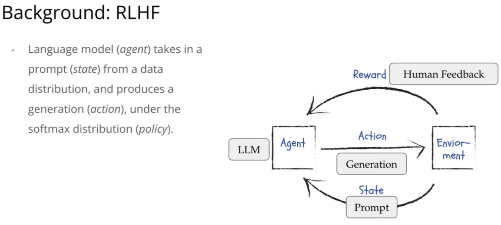
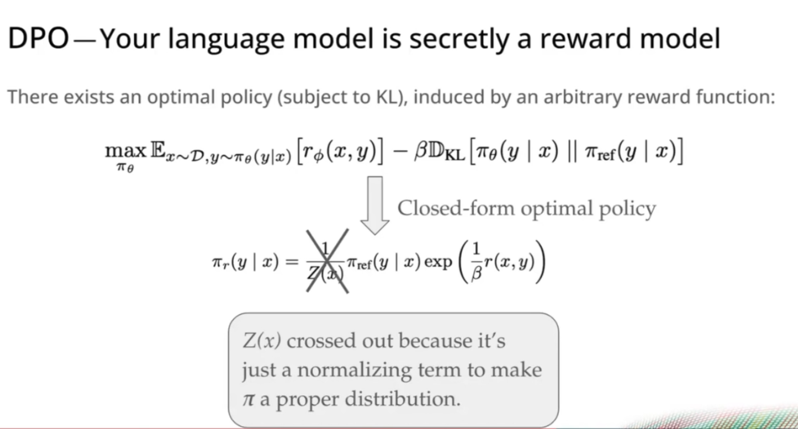
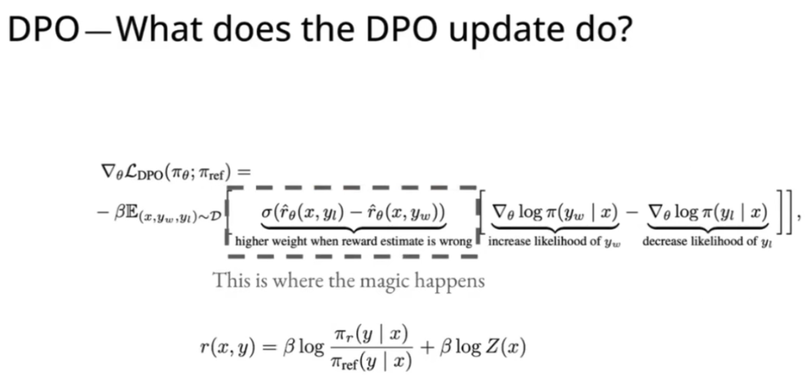

# Week6: Alignment and Chatbots

## Learning

1. Alignment

    Instruction-tuned language models are capable of impressive task performance but can sometimes exhibit undesirable behavior. Below are specific examples illustrating both desirable and problematic responses from such models. These examples highlight the importance of alignment between user instructions and ethical values.

2. Reinforcement Learning from Human Feedback

    RLHF components in LLMs:

    

    How are binary preferences / ranking turned into rewards?

    Reward modeling: parametrize a reward model using weights of a pre-trained language model, and fine-tune it to outout consistent rankings as humans

    - **Reward Modeling**

        Bradley-Terry turns a reward model $r$ into a binary preference "classifier" $p$,
        $$p^*(y_1 > y_2 | x) = \frac{exp(r^*(x, y_1))}{exp(r^*(x, y_1)) + exp(r^*(x, y_2))}$$

        Minimize log loss to correctly classify human preferences induces a useful reward model.
        $$\mathcal{L}_{R}(r_{\phi}, \mathcal{D}) = - \mathbb{E}_{(x, y_{w}, y_{l}) \sim \mathcal{D}} \left[ \log \sigma \left( r_{\phi}(x, y_{w}) - r_{\phi}(x, y_{l}) \right) \right]$$

    - **RLHF Objective**

        RLHF tunes the language model to maximize reward, subject to a KL-divergence penalty between the optimized model $\pi_{\theta}$ and an unoptimized reference model $\pi_{\text{ref}}$ (almost always, SFT model).

        $$\max_{\pi_{\theta}} \mathbb{E}_{x \sim D, y \sim \pi_{\theta}(y|x)} [r_{\phi}(x, y)] - \beta \mathbb{D}_{\text{KL}} [\pi_{\theta}(y | x) || \pi_{\text{ref}}(y | x)]$$

    - **RLHF Optimization**

        In principle, any “policy gradient” algorithm would work. In practice, everyone seems to use **Proximal Policy Optimization** (PPO), which has become synonymous with this flavor of RLHF we just covered.

        Policy gradient methods update model parameters to maximize expected reward. PPO in particular clips objective in a range to ensure stable updates.

3. Direct Preference Optimization (DPO)

    

    If we rearrange terms, we can show $$r(x, y) = \beta \log \frac{\pi_{r}(y|x)}{\pi_{ref}(y|x)} + \beta \log Z(x),$$ that is any language model implies a reward model.

    Then if we plug this reward into the reward modeling loss function above, we have $$\mathcal{L}_{\text{DPO}}(\pi_\theta; \pi_{\text{ref}}) = -\mathbb{E}_{(x, y_w, y_l) \sim \mathcal{D}} \left[ \log\sigma \left( \beta \log \frac{\pi_\theta(y_w | x)}{\pi_{\text{ref}}(y_w | x)} - \beta \log \frac{\pi_\theta(y_l | x)}{\pi_{\text{ref}}(y_l | x)} \right) \right]$$

    

## Interesting Notes from Piazza

- 
