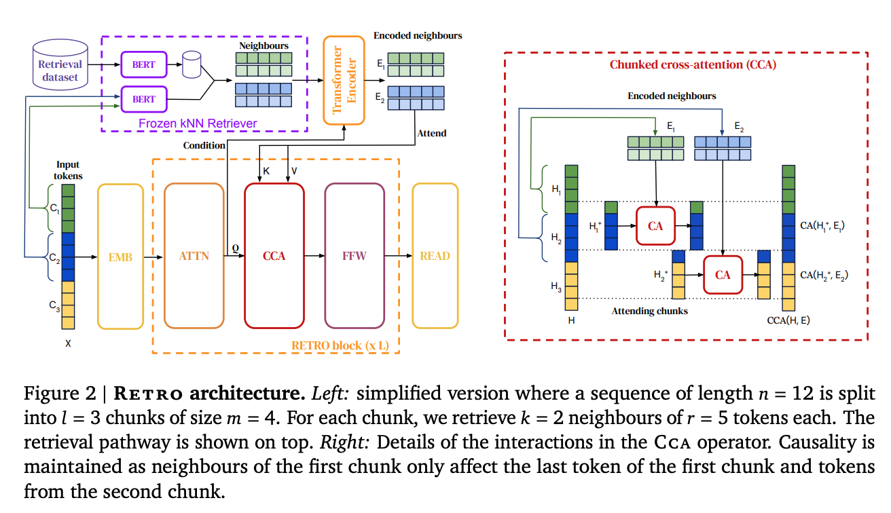
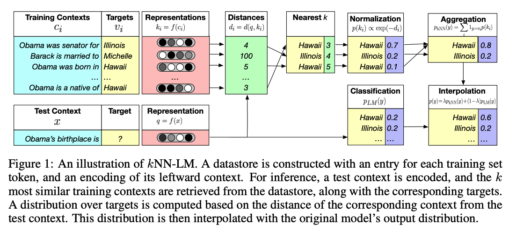
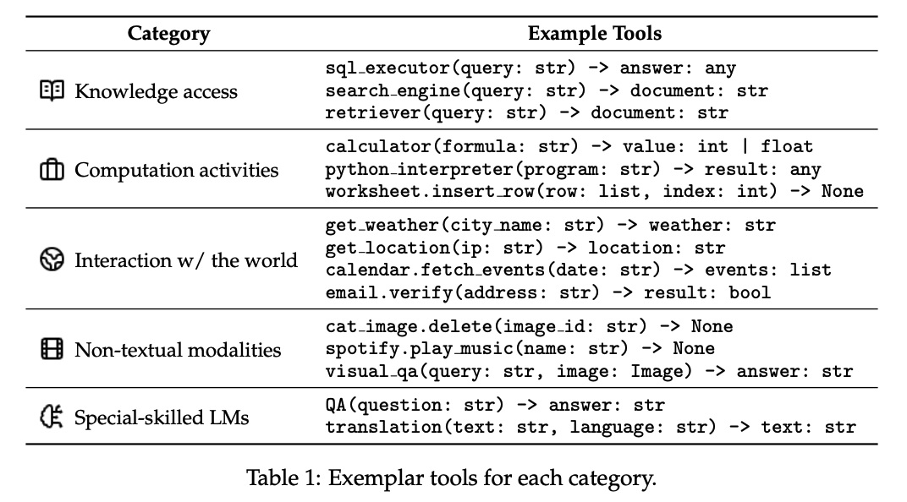
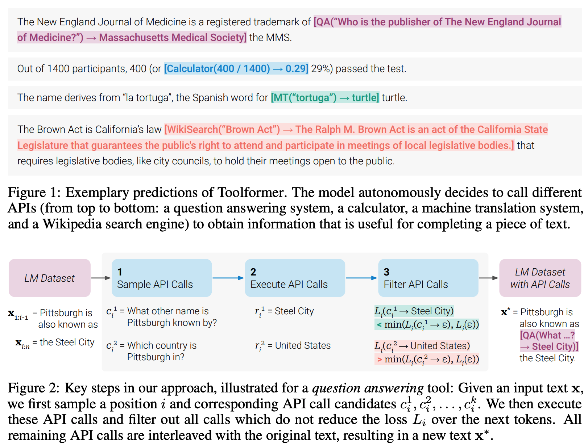
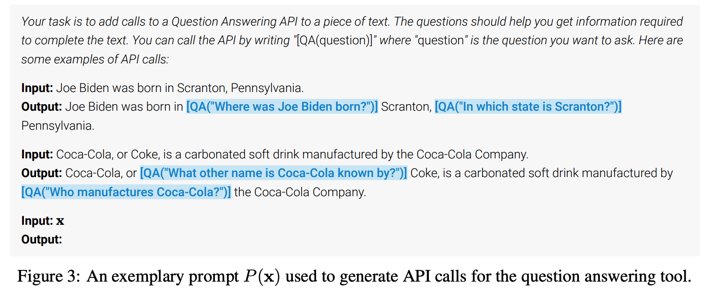

# Week7: Retrieval Augmentation, Tool Use and AI agents

## Learning

1. Retrieval-augmented LMs

    Benefits:
    - Reduce hallucination
    - Adaptation without training
    - Providing attribution
    - Flexible data opt-in/-out
    - Parameter efficiency

    Diverse architectures:
    - Input Augmentation
        - Expensive to scale up to thousands of documents
        - No stric attributions to specific evidences
    - Intermediate incorporation (RETRO, Instruct RETRO)
        
        - Require modification of underlying LMs
        - Expensive pre-training
        - No stric attributions
    - Output Interpolation (kNN LM)
        
        - Hard to scale up to large retrival corpora
        - Limited effectiveness outside of upstream language modeling tasks

2. Tool Use

    

    Training an LLM to Use Tools

    LLMs learn to generate tool function calls and incorporate the functions’ return values into their responses through training. This is normally a two-step process:
    - Pretraining with Code

        Most tool calls are executed as programming API calls, often in Python. To ensure the LLM has a foundational understanding of how to produce code snippets, code must be included in the pre-training data. Without this initial step, it would be difficult for an LLM to generate accurate function calls needed for executing tools, even after finetuning.

    - Finetuning for Tool Calling

        Even if an LLM has been pretrained with knowledge of Python, additional finetuning is required to teach it how to leverage that coding capability for tool usage. Through finetuning on tool-use data, the model is taught to identify when and how to call external tools, and how to integrate the output seamlessly into its responses.

    In 2023, the [Toolformer](https://arxiv.org/pdf/2403.15452v1) paper introduced an approach which is still widely used today: use an LLM to annotate text strings with API calls, and then finetune on the annotated data.

    

    

    The Toolformer approach was the first significant effort toward finetuning for tool-use and was developed before finetuning for instruction-following was common. You can see that most of the examples we've given on this page (such as the ones in the table above) insert tool calls into otherwise unstructured documents.

3. AI Agents

## Interesting Notes from Piazza

- 
