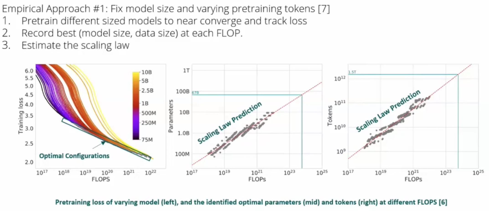
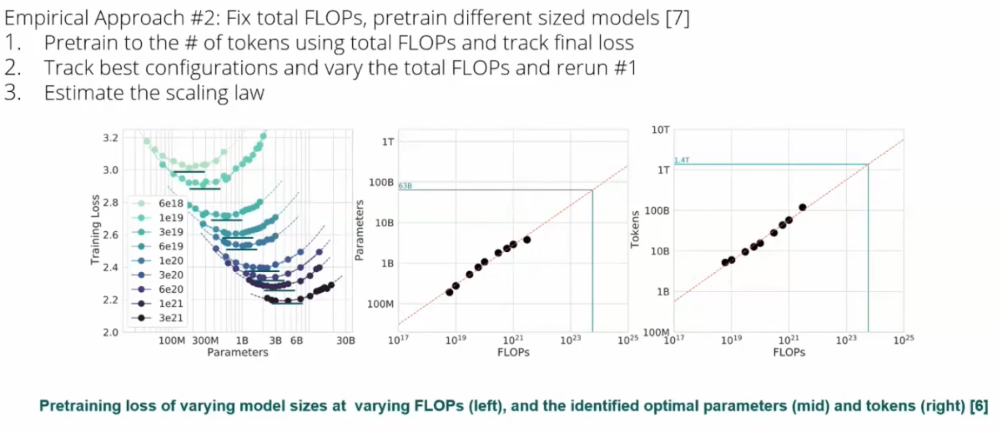
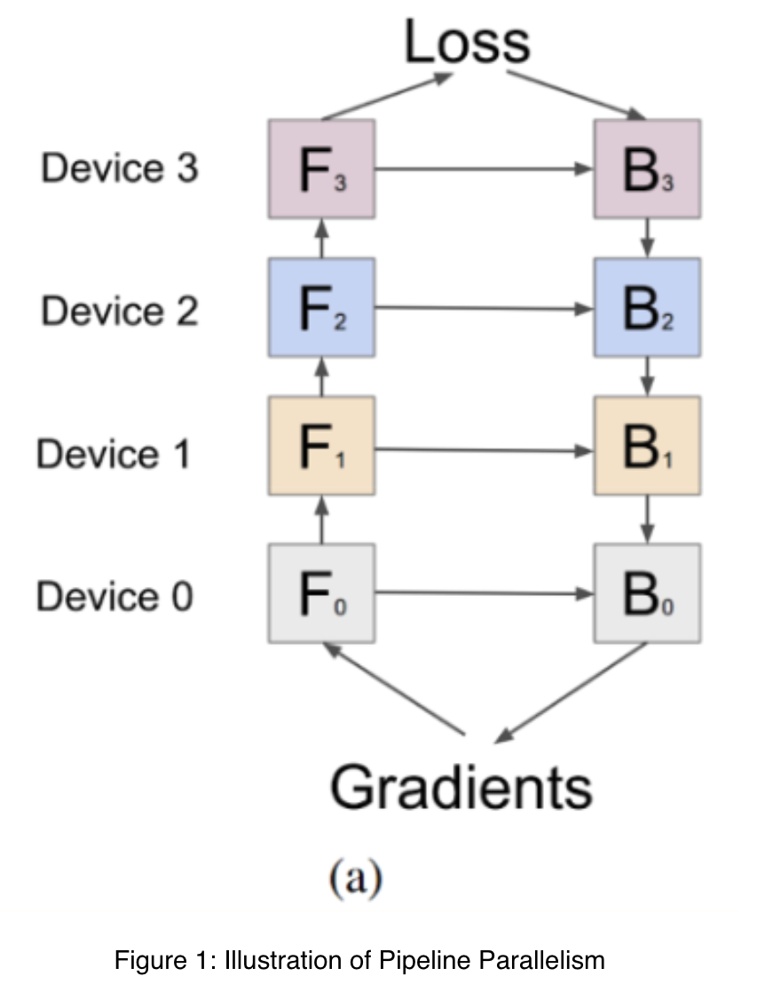
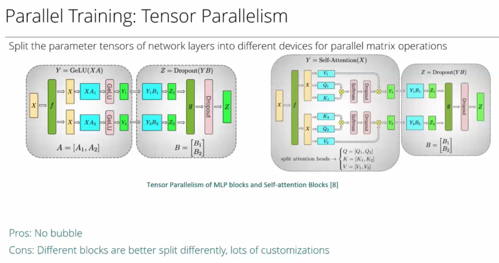

# Week8: Scaling up

## Learning

1. Scaling Laws of LLMs

    Which language model to use?

    - Popular choice: Decoder-only models + Autoregressive language models. Better generalization right after pre-training, no multi-task supervised fine-tuning needed.
    - Easy to scale up: 1) More training signals per sequence 2) Converges fast 3) More stable

    What factors matter?

    - Network shape (allocation of parameters): do not matter very much
    - Compute, Dataset size, # Parameter: log-linear relationship with model performance

    Given a compute budget, how to select the optimal scaling up configuration?

    

    

2. Optimization

3. Parallel Training

    Techniques to Optimize Single-GPU Efficiency

    - Checkpointing: This involves offloading parts of GPU memory to CPU memory. With CPU memory widely available, this strategy helps optimize GPU memory usage.
    - Quantization: This technique reduces the precision of the model's computations, potentially using as few as 4 bits, to save on GPU memory without compromising model performance significantly.
    - Infrastructure Improvements (e.g., Flash Attention): Infrastructure optimizations, like Flash Attention, can make models feasible on a single GPU that otherwise wouldn’t fit, particularly benefiting both training and inference phases.

    Despite these optimizations, the need for more computational power—or "FLOPS" (Floating Point Operations Per Second)—often leads to parallel training setups.

    Parallel Training Setups

    - Data Parallelism: If the model fits within a single GPU but requires a larger dataset or more computational power, data parallelism can help by splitting data across multiple GPUs.
    - Model Parallelism: When the model size exceeds a single GPU’s memory capacity, model parallelism becomes essential. For example, if you have a 70-billion parameter model but only a 40 GB GPU, the model won't fit in one GPU, requiring model parallelism. This setup can involve different approaches and tradeoffs, balancing efficiency and resource allocation.

    Understanding and selecting the appropriate parallel training strategy ensures efficient resource use and facilitates the handling of increasingly complex LLMs.

4. Pipeline and Tensor Parallelism (Splitting the Model Across Multiple GPUs)

    To accommodate these large models, we use parallelism to distribute the load across multiple GPUs. There are two primary methods:
    - Inter-Layer Splitting (Pipeline Parallelism): The model is divided layer by layer, and layers are assigned to different GPUs.
    - Intra-layer Splitting (Tensor Parallelism): Each layer itself is split across multiple GPUs.

    1. __Pipeline Parallelism__ is one of the most commonly used strategies to address large model sizes in multi-GPU setups.

        

        At the start of training, Device 0 performs a forward computation on the first data batch and passes the activation to Device 1. Meanwhile, Device 0 must wait for Device 1 to finish its computation before it can start another forward pass.After the forward pass completes across all devices, the backward pass starts from the last device, propagating gradients back to Device 0. A bubble is created during these waits, where devices are idle due to dependencies between layers. This reduces compute utilization, creating inefficiencies in training.

        To mitigate this issue, one can split the batch into mini-batches or micro-batches, allowing devices to work on different parts of the data concurrently. However, this only reduces the bubble; it cannot eliminate it entirely, especially with many devices.

        For inference, pipeline parallelism is more efficient since there’s no backward pass or gradient computation, so devices do not need to wait as much.

        Pipeline parallelism leverages the layered structure of deep neural networks, making it a practical method for distributing training across multiple devices. Despite the computational inefficiencies introduced by the bubble, its simplicity and broad applicability make it valuable in large-scale LLM training.

    2. __Tensor parallelism__ splits individual weights, gradients, and optimizer states, allowing for a fine-grained distribution of computational tasks.

        

## Interesting Notes from Piazza

- 
